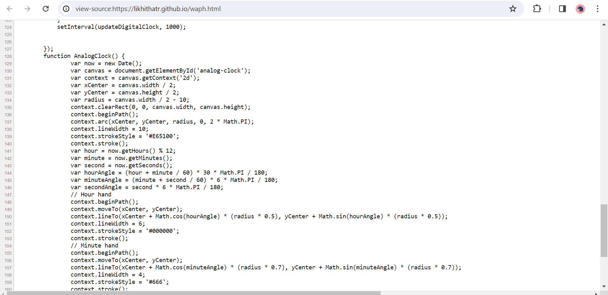
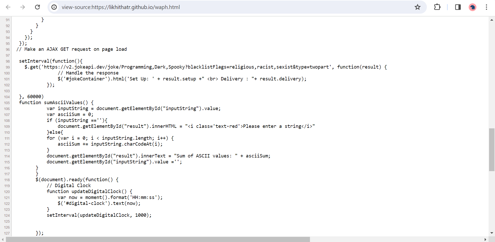
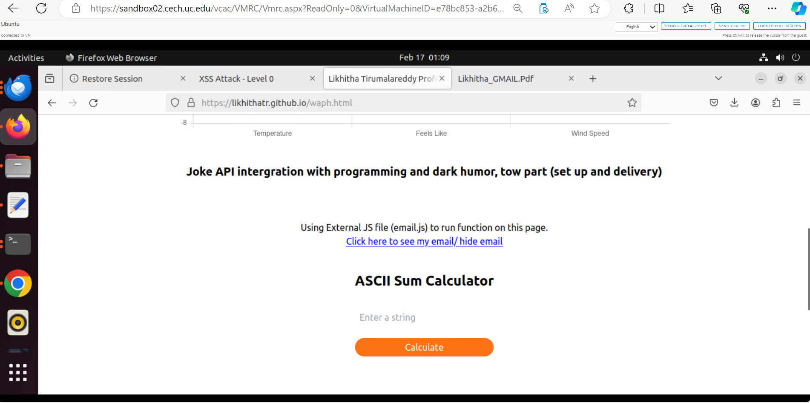

# Web Application Programming and Hacking

## Instructor : Dr Phu Phung

## Student
**Name** : Likhitha Tirumalareddy

**Email** : tirumala@mail.uc.edu


## MyShort-bio: I possess a keen enthusiasm for developing interactive and responsive webpages.


# Individual Project 1

The project revolves around crafting a professional portfolio that encompasses details such as education, experience, employment history, skills, and other relevant information. You can review my portfolio by following the link provided below.

[My Portfolio](https://likhithatr.github.io/index.html)

[Repositoy URL](https://github.com/LikhithaTR/LikhithaTR.github.io)


A link to this course page ```https://likhithatr.github.io/index.html``` was provided in my education section in portfolio , you can see screenshot for reference.


### Non-technical requirements (20 pts)​
Utilize an open-source CSS template or framework like Bootstrap for styling. I opted for Tailwind CSS to design the entire page, employing a CDN link for convenience. The specific CDN link used is `<script src="https://cdn.tailwindcss.com"></script>`. Tailored towards a potential employer, this profile is subject to evaluation as part of a job application. My skills and expertise, tailored to meet the needs of my target employer, are detailed in both my portfolio and the accompanying screenshot..


Include a page tracker, for example: https://analytics.google.com/analytics/web/?pli=1#/p428016586/reports/intelligenthome


### Technical requirements (50 pts)​

Implement basic JavaScript code worth 20 points by incorporating jQuery and an additional open-source JavaScript framework or library. This code should cover the Lab 2 functionalities, comprising a digital clock, an analog clock, a show/hide mechanism for your email, and one more functionality of your choosing (each worth 5 points).







Make sure to establish a link from the main file "index.html" to the course page "waph.html." Additionally, adopt a distinctive approach to the Lab 2-related hands-on exercises within the "waph.html" file.

For the integration of two public Web APIs (20 pts), incorporate the jokeAPI (https://v2.jokeapi.dev/joke/Any) by selecting jokes from any category, similar to Lab 2.2.d.i. The goal is to display a new joke on your page every minute. In this instance, I opted for a two-part joke type with dark humor as the genre, excluding certain types of jokes. This choice stems from my previous use of an API in programming, presenting an opportunity to explore different parameters and enhance the variety of jokes displayed.
HTML code


Integrated a public API with graphics, utilizing the Weatherbit API for obtaining details on Cincinnati's location. Displayed the information in a graphical format, as depicted in the screenshot.


Implementing a functionality worth 10 points, I've employed JavaScript cookies to remember the client. If it's the first visit, a message "Welcome to my homepage!" is displayed; otherwise, a message "Welcome back! Your last visit was on 'the date/time of the last visit'" is shown. To achieve this, I've organized the implementation using multiple functions for modularity. These functions handle setting cookies during the first visit, updating the cookie with the number of visits and the last visited time, and ultimately displaying a welcome message on the page.





